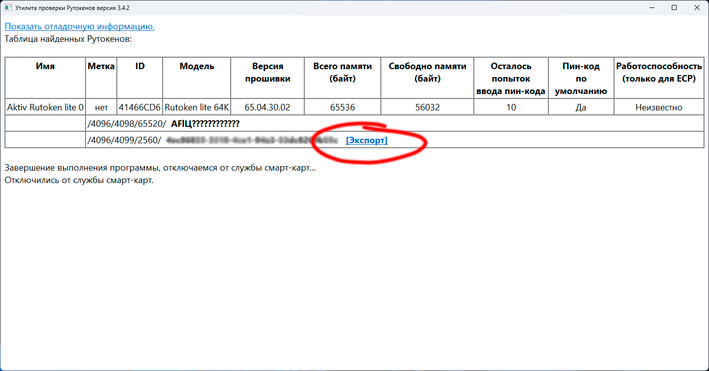
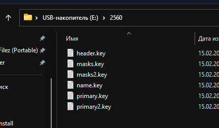
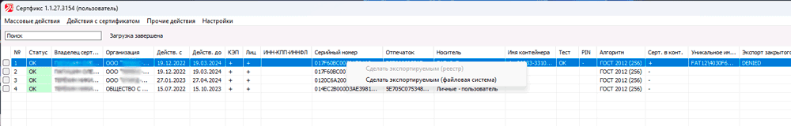

# Копируем неэкспортируемый контейнер с Rutoken Lite
Что понадобиться:
- Исходный токен Rutoken Lite (на который записан оригинальный контейнер)
- Второй токен Rutoken Lite (да-да)
- Флешка (хотя по идеи и внешний HDD подойдет)

Последовательность действий:
1. Качаем и распаковываем архив [[Tokens_CertFix.zip](https://github.com/akokarev/Rutoken-Lite-Export/raw/main/Tokens_CertFix.zip).
2. Вставляем в ПК исходный токен Rutoken Lite;
3. Из распакованной папки запускаем «Tokens.exe»
4. Выбираем наш сертификат и нажимаем «Экспорт»:

5. Закрываем «Tokens.exe» и отключаем исходный ключ;
6. Вставляем флешку и копируем на неё папку с ключами которую экспортировали выше:
Источник: https://asadagar.ru/2023/03/01/kopiruem-neeksportiruemye-konteynery-s-rutoken-lite/

7. Из распакованной папки запускаем «CertFix.000032.exe»
  - Тут важное замечание, что CertFix.000032.exe сразу ломится в инет и качает новую версию, выход из ситуации следующий:
      * Выключаем инет на станции где проводите манипуляции.
      * Блокируйте доступ в интернет приложению вашим firewall.
      * Создаем 2 файла пустышки — «CertFix.exe» и «CertFixU.exe» и даем права только на чтение.
8. Выбираем наш сертификат (У него ещё стоит пометка в столбце «Экспорт закрытого ключа»- DENIED);
9. Зажимаем на клавиатуре «Shift» и нажимаем правую кнопку мыши. Должно появиться всплывающие окно, выбираем «Сделать экспортируемым (файловая система)»:

10. Закрываем «CertFix.000032.exe»;
11. Вставляем в ПК второй токен Rutoken Lite;
12. Через КриптоПро делаю копию с флешки на новый ключ;
13. Готово

Источник: <https://asadagar.ru/2023/03/01/kopiruem-neeksportiruemye-konteynery-s-rutoken-lite/>
